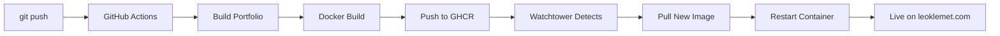

# 🚀 Ready to Deploy - Quick Reference

**Version**: v0.4.0
**Date**: October 17, 2024
**Branch**: `portfolio-polish`

---

## ✅ Everything is Ready!

All components for **automated zero-SSH deployment** are complete:

- ✅ Docker image v0.4.0 pushed to GHCR
- ✅ GitHub Actions CI/CD workflow configured
- ✅ Watchtower auto-deployment setup ready
- ✅ Comprehensive documentation created
- ✅ All code committed and pushed to GitHub

---

## 📖 Choose Your Guide

### 🎯 **Quick Deploy** (Recommended)
**File**: `DEPLOYMENT_QUICKSTART.md`
**Use when**: You want step-by-step deployment instructions
**Time**: 15-30 min one-time setup, then 3-4 min automated deploys

### ✅ **Checklist Format**
**File**: `DEPLOYMENT_CHECKLIST.md`
**Use when**: You want checkbox-style tracking
**Time**: Same as quickstart, but with progress tracking

### 📚 **Detailed Guide**
**File**: `WATCHTOWER_SETUP.md`
**Use when**: You need comprehensive explanations and troubleshooting
**Time**: Full documentation with all scenarios

### 📊 **Status Overview**
**File**: `AUTOMATED_DEPLOYMENT_STATUS.md`
**Use when**: You want architecture and timeline details
**Time**: Reference for understanding the whole system

---

## ⚡ Super Quick Start (TL;DR)

If you just want the essential commands:

### On Production Server (SSH once)

```bash
# 1. Create directory
mkdir -p ~/leo-portfolio && cd ~/leo-portfolio

# 2. Download config
curl -fsSLO https://raw.githubusercontent.com/leok974/leo-portfolio/portfolio-polish/deploy/docker-compose.portfolio-ui.yml

# 3. Start everything
docker compose -f docker-compose.portfolio-ui.yml up -d

# 4. Verify
docker ps | grep -E 'portfolio-ui|watchtower'
curl -s http://localhost:8089/ | grep -oE 'main-[A-Za-z0-9_-]+\.js'
```

### Update Nginx

```nginx
location / {
    proxy_pass http://portfolio.int:80;
}
```

```bash
docker exec applylens-nginx-prod nginx -s reload
```

### Purge Cloudflare & Verify

```bash
# Purge cache (from local machine)
curl -X POST "https://api.cloudflare.com/client/v4/zones/$CF_ZONE_ID/purge_cache" \
  -H "Authorization: Bearer $CF_API_TOKEN" \
  -H "Content-Type: application/json" \
  --data '{"purge_everything":true}'

# Verify live
curl -s https://leoklemet.com/ | grep -oE 'main-[A-Za-z0-9_-]+\.js'
```

**Done!** Future deploys = just `git push origin main` 🎉

---

## 🔑 Key Benefits

### Before (Manual)
- SSH to server every deploy
- Build or upload files manually
- Restart containers manually
- Clear cache manually
- Verify manually
- **Time**: 15-30 min per deploy
- **Error-prone**: Easy to forget steps

### After (Automated)
- Just `git push origin main`
- CI builds automatically
- Watchtower deploys automatically
- Cache purge automatic (with secrets)
- **Time**: 3-4 min per deploy
- **Reliable**: Same process every time

---

## 📊 What Happens on `git push`



**Timeline**:
- T+0:00 → Push to GitHub
- T+2:30 → CI completes build & push
- T+3:30 → Watchtower deploys
- **Total: ~3-4 minutes** 🚀

---

## 🆘 Need Help?

### For Setup
→ **`DEPLOYMENT_QUICKSTART.md`** (start here!)

### For Troubleshooting
→ **`WATCHTOWER_SETUP.md`** (sections: Monitoring, Troubleshooting, Rollback)

### For Architecture
→ **`AUTOMATED_DEPLOYMENT_STATUS.md`** (how everything fits together)

### For Tracking Progress
→ **`DEPLOYMENT_CHECKLIST.md`** (checkbox-style checklist)

---

## 🔗 Important Links

- **Production Site**: https://leoklemet.com/
- **GitHub Actions**: https://github.com/leok974/leo-portfolio/actions
- **Docker Images**: https://github.com/leok974/leo-portfolio/pkgs/container/leo-portfolio%2Fportfolio
- **GitHub Repo**: https://github.com/leok974/leo-portfolio
- **Cloudflare Dashboard**: https://dash.cloudflare.com/

---

## 📦 What's in v0.4.0

- ✅ Layout feature enabled (`VITE_LAYOUT_ENABLED=1`)
- ✅ All 12 E2E tests passing
- ✅ Assistant panel fixes
- ✅ Build hash: `main-D0fKNExd.js`
- ✅ Docker image: 74 MB optimized nginx image

See `FINALIZATION_COMPLETE_OCT17.md` for full details.

---

## 🎯 Next Steps

1. **Choose a guide** from the list above
2. **Follow the steps** (one-time 15-30 min SSH setup)
3. **Test automated deployment** (push a small change)
4. **Enjoy hands-free deploys** forever! 🎉

---

## 💡 Optional Enhancements

After basic setup works:

1. **Add GitHub Secrets** for auto cache purging:
   - `CF_API_TOKEN` - Cloudflare API token
   - `CF_ZONE_ID` - Zone ID for leoklemet.com
   - Location: https://github.com/leok974/leo-portfolio/settings/secrets/actions

2. **Set up Notifications**:
   - Add Slack/Discord webhook to Watchtower
   - Get notified when deployments happen

3. **Add Smoke Tests**:
   - Extend GitHub Actions to run E2E tests
   - Auto-rollback on test failures

---

## 🚨 Rollback (If Needed)

**No SSH required!**

```bash
# Pull old version
docker pull ghcr.io/leok974/leo-portfolio/portfolio:v0.4.0

# Tag as latest
docker tag ghcr.io/leok974/leo-portfolio/portfolio:v0.4.0 \
           ghcr.io/leok974/leo-portfolio/portfolio:latest

# Push (Watchtower auto-deploys in ~60s)
docker push ghcr.io/leok974/leo-portfolio/portfolio:latest
```

---

## ✨ Summary

**You have everything you need to deploy!**

- 📖 **4 comprehensive guides** ready
- 🐳 **Docker image** built and pushed
- ⚙️ **GitHub Actions** configured
- 🔄 **Watchtower** ready to auto-deploy
- 📝 **Documentation** complete

**Just pick a guide and follow it!**

**Recommended**: Start with **`DEPLOYMENT_QUICKSTART.md`** → it's concise and gets you up and running fast.

---

🚀 **Happy deploying!**
