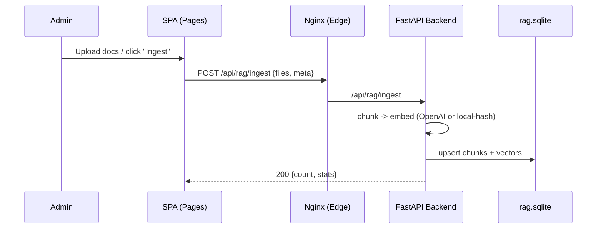
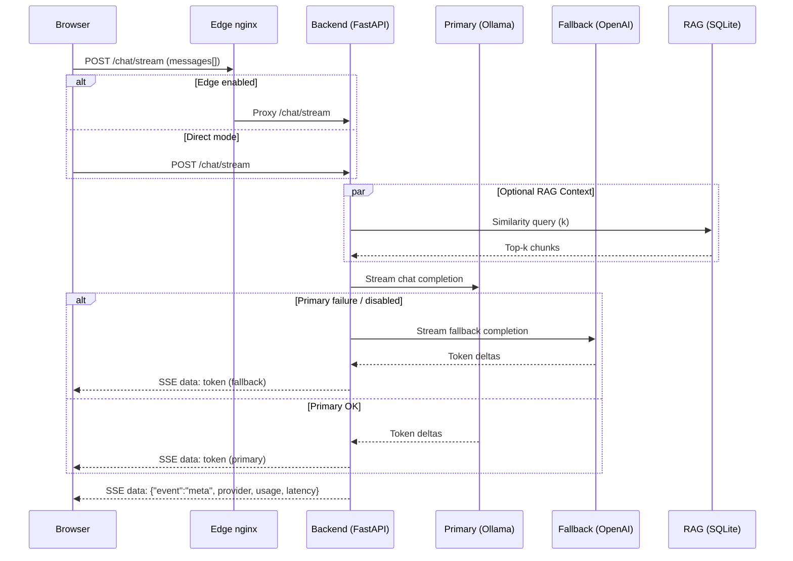

# Architecture

> Draft – initial scaffold. Expand with diagrams (Mermaid) and sequence flows.

## Overview
A hybrid AI assistant platform consisting of:
- Frontend: static site (now baked into the edge nginx image via multi-target Dockerfile) or optionally hosted on GitHub Pages.
- Edge Proxy: nginx serving SPA assets + reverse proxy for API + SSE streaming.
- Backend: FastAPI service exposing chat, RAG query, health/metrics, and LLM diagnostics.
- Model Host: Ollama container (primary) with automatic fallback to OpenAI-compatible API.
- RAG Store: SQLite (`data/rag.sqlite`) + embeddings (OpenAI or local model) accessed via lightweight query endpoint.

### Component Diagram (Mermaid)
```mermaid
flowchart LR
    subgraph Browser[User Browser]
        UI[Assistant Dock / JS Widgets]
    end

    UI -->|HTTPS| Edge{Edge nginx?}
    Edge -->|/api/* /chat/*| Backend[FastAPI Backend]
    UI -->|Direct (no edge mode)| Backend
    Backend -->|Primary LLM API| Ollama[(Ollama)]
    Backend -->|Fallback (OpenAI)| OpenAI[(OpenAI API)]
    Backend -->|Embeddings / Vector Query| RAG[(SQLite + Vectors)]

    classDef svc fill=#0d3b66,stroke=#0d3b66,color=#fff;
    classDef ext fill=#5f0f40,stroke=#5f0f40,color=#fff;
    class Backend,Edge,UI svc;
    class Ollama,OpenAI,RAG ext;
```

## Data Flow
```
User Browser -> (Edge nginx) -> Backend FastAPI -> (Primary: Ollama / Fallback: OpenAI)
                                 |
                                 +--> RAG (SQLite embeddings)
```

### Chat (Streaming)
1. Browser POST /chat/stream (SSE)
2. Edge proxies to backend `/chat/stream` (proxy_buffering off)
3. Backend chooses provider: primary (Ollama) unless disabled/unhealthy, else fallback
4. Tokens streamed as `data:` events; a final `meta` event includes provider stats

### RAG Query
1. Browser (or backend internal) POST `/api/rag/query` with `{question,k}`
2. Backend runs embedding → vector similarity in SQLite
3. Returns matched chunks + source metadata
4. Chat pipeline can prepend context (future augmentation)

### Health & Metrics
- `/ready` – readiness / dependency check (DB + provider reachability)
- `/status/summary` – aggregate model presence & fallback state
- `/metrics` – rolling counts (requests, 5xx, token in/out, p95 latency, provider distribution)

## Deployment Modes
| Mode | Components | Notes |
|------|------------|-------|
| Local Dev | Backend + Ollama + static served by `run_web.bat` or Live Server | Fast iteration; no edge |
| Full Compose (legacy) | `ollama`, `backend`, `frontend`, `edge` | Previous separate frontend container (superseded by unified edge build) |
| Unified Edge (current) | `ollama`, `backend`, `nginx(edge+frontend)` | Preferred production mode |
| GitHub Pages + Backend | Frontend on Pages, backend + edge on a VPS | CORS allowlist must include Pages domain |

## Key Resilience Mechanisms
- Automatic fallback if primary model errors / unreachable
- Rolling latency probe endpoint `/llm/primary/latency`
- Explicit deprecation notice on legacy `chat-latency` endpoint
- Health classification used for readiness gating
- Direct (in‑process) RAG health probe (bypasses HTTP) prevents edge routing issues from surfacing as false-negative `rag.ok=false`.
- Bounded model warmup (`MODEL_WAIT_MAX_SECONDS`) + optional `DISABLE_PRIMARY=1` fast path for CI / rapid dev.

## Security & Isolation
- Backend runs as non-root `appuser` UID 1001
- Secrets injected via Docker secrets (`openai_api_key`) or env
- CORS restricted to configured allowlist
- SSE route disables buffering to avoid head-of-line blocking

## Future Enhancements (TODO)
### RAG Ingestion (mini sequence)



### Chat Streaming (Detailed)

- Add rate limiting at edge layer (limit_req)
- Expand RAG ingestion pipeline & incremental update path
- Structured logging with request IDs propagated via headers
- Multi-model routing (policy based on cost/perf)

### Edge CORS for Status Endpoints
Status data must be reliably retrievable cross-origin (GitHub Pages or app domain) even on error paths.

Strategy:
* Prefer clients use `/api/status/summary` (edge rewrites internally to `/status/summary`).
* Nginx injects CORS headers for both `/api/status/*` and legacy `/status/*` so 4xx/5xx responses still include `Access-Control-Allow-Origin`.
* Legacy path normalizes headers: upstream `Access-Control-Allow-Origin` and `Vary` are hidden (`proxy_hide_header`) and a single canonical pair is added.
* Cache disabled via `Cache-Control: no-store, no-cache, must-revalidate, max-age=0` to reflect live model / readiness state.
* OPTIONS preflight returns `204` when intercepted by edge; otherwise backend may answer `200` and CI accepts both.

Rationale: Avoiding silent CORS failures simplifies external health dashboards and GitHub Pages integrations.

#### CORS Decision Flow (Mermaid)
```mermaid
flowchart LR
    A[Incoming Request] --> B{Path matches /api/status/ or /status/ ?}
    B -->|No| Z[Normal routing (no special CORS injection)]
    B -->|Yes| C{Has Origin header?}
    C -->|No| D[Pass through + add Cache-Control no-store]
    C -->|Yes| E{Origin in allowlist regex?}
    E -->|No| F[Pass through (no A-C-A-O) + no-store]
    E -->|Yes| G[Inject A-C-A-O + Vary]
    G --> H{Legacy /status/?}
    H -->|Yes| I[Hide upstream duplicates (proxy_hide_header) then add canonical]
    H -->|No| J[Rewrite /api/status/* -> /status/*]
    I --> K[Return]
    J --> K[Return]
```

### Edge Readiness & Warming Behavior
To eliminate user-visible 502s and provide deterministic readiness signaling, the edge layer (nginx) implements:

1. Health-gated startup: `nginx` defers until `backend` passes a compose healthcheck hitting `/api/ready` (alias of backend readiness).
2. Warming JSON intercept: During model warmup or backend restart, upstream 5xx responses for `/api/status/summary` are intercepted and replaced with a stable HTTP 200 JSON payload:
    ```json
    {"ok":false,"ready":false,"llm":{"path":"warming"},"rag":{"ok":true}}
    ```
3. No-store caching headers ensure clients always reflect live readiness.
4. Frontend polls every 5–10s; `llm.path == "warming"` is treated as transitional, not failure.

Combined these mechanisms remove cold-start error noise while preserving transparent state for dashboards.


