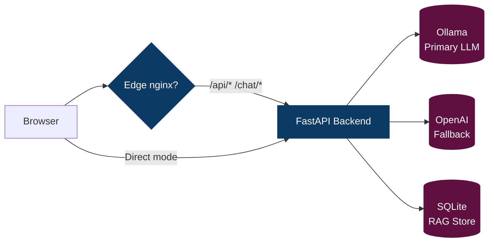

| `PRIMARY_POLL_MAX_S` | Max seconds to keep polling for primary model presence before giving up. |
| `ALLOW_FALLBACK` | (Tests) When `1`, skips Playwright no-fallback guard specs so CI can proceed while primary model unavailable. |
# Deploy Guide

> Draft. Consolidates deployment notes from `deploy/README.md` and adds full-stack + edge proxy guidance.

## Deployment Topology



**Deployment Modes**:
- **Local Dev**: Browser → Backend (http://127.0.0.1:8001)
- **Full Stack**: Browser → Edge nginx → Backend → Ollama/OpenAI + RAG
- **GitHub Pages**: Browser (GitHub Pages) → Edge nginx → Backend

## Prerequisites
- Docker & Docker Compose v2
- (Optional) Domain & DNS (A/AAAA records or Cloudflare Tunnel)
- OpenAI (fallback) API key stored securely (not committed)

## Secrets & Env
| Secret | Purpose | Injection |
|--------|---------|-----------|
| `openai_api_key` (Docker secret) | Fallback OpenAI model auth | `secrets/` file mounted or swarm/compose secret |
| `FALLBACK_API_KEY` env | Alternate fallback injection | Runtime env var (dev) |

Backend `.env.prod` example:
```
RAG_DB=./data/rag.sqlite
RAG_REPOS=leok974/ledger-mind,leok974/leo-portfolio
EMBED_MODEL_QUERY=openai/text-embedding-3-large
OPENAI_BASE_URL=http://ollama:11434/v1
OPENAI_MODEL=qwen2.5:7b-instruct-q4_K_M
FALLBACK_BASE_URL=https://api.openai.com/v1
FALLBACK_MODEL=gpt-4o-mini
ALLOWED_ORIGINS=https://leok974.github.io,http://localhost:8080
DOMAIN=assistant.ledger-mind.org
# Dangerous tool gating (default off). Enable only when you need Admin Rebuild UI.
ALLOW_TOOLS=0
ALLOW_SCRIPTS=scripts/rag-build-index.ps1
# Agent orchestration admin API key (for pruning historical records)
ADMIN_API_KEY=your-strong-random-key-here
```

**Security Notes:**
- `ADMIN_API_KEY`: Required for `/agents/tasks/before` (DELETE) endpoint. Generate a strong random key (e.g., `openssl rand -hex 32`). Store securely in server environment, never commit to repository.
- Used by GitHub Actions workflow for automated weekly pruning of old agent task records.

Frontend env (Vite) hints:
```
VITE_SSE_GRACE_MS=1800          # base grace for initial SSE token; UI extends on heartbeats
VITE_PRIMARY_MODEL=gpt-oss:20b  # optional hint to add a small grace bump for heavy local models
```

## Compose Files
| File | Purpose |
|------|---------|
| `deploy/docker-compose.yml` | Core stack (ollama + backend + nginx proxy) |
| `deploy/docker-compose.full.yml` | (Legacy) previously added separate frontend + edge; now unified build in prod compose |
| `deploy/Dockerfile.frontend` | Multi-target (static or Vite) edge + SPA build + API proxy |
| `assistant_api/Dockerfile` | FastAPI backend multi-stage (wheels + slim runtime) |

> SQLite ingestion hardening: the backend now forces WAL mode, increases the busy timeout, and wraps connections/commits in a 5× exponential backoff. This prevents `sqlite3.OperationalError: database is locked` when warmup jobs and `/api/rag/ingest` overlap during boot.

### Environment Variable Sources (Important)
Docker Compose resolves variable references like `${PRIMARY_MODEL}` at *parse time* from:
1. The shell environment you invoke `docker compose` from.
2. A `.env` file located in the same directory as the compose file (here: `deploy/.env`).

It does **not** read values from the service `env_file:` entries (e.g. `assistant_api/.env.prod`) for interpolation. Those are only injected *inside the container* after it starts.

Implications:
- If `${PRIMARY_MODEL}` appears in `docker-compose.prod.yml` and you only added it to `assistant_api/.env.prod`, Compose will warn: `The "PRIMARY_MODEL" variable is not set...` and fall back to the default in the compose expression.
- To avoid the warning and have a single canonical definition, either export it in your shell or put `PRIMARY_MODEL=...` in `deploy/.env` (now added).
- Container runtime environment still merges: compose interpolation values + `env_file` entries + explicit `environment:` section.

Recommended pattern adopted here:
- `deploy/.env` (non-secret, interpolation-only): `PRIMARY_MODEL=gpt-oss:20b`
- `assistant_api/.env.prod` (runtime config: can reference non-secret operational values, excludes secrets)
- Secrets (API keys) via Docker secrets or environment variables supplied securely at deploy time.

Makefile targets (`prod-up`, `prod-rebuild`) defensively export a fallback `PRIMARY_MODEL` if you invoke them without setting one, ensuring consistent behavior in local and CI environments.

Port Remap Note: Production compose maps edge to host `8080` (HTTP) / `8443` (HTTPS) instead of privileged 80/443 to reduce conflicts on developer laptops. Adjust in `deploy/docker-compose.prod.yml` if deploying to a clean server and binding low ports with CAP_NET_BIND.

## Quick Start (Full Stack)
```bash
cd deploy
# build and run all services
docker compose -f docker-compose.full.yml up -d --build

# pull/update primary model
docker exec -it $(docker ps -qf "name=ollama") bash -lc "ollama pull qwen2.5:7b-instruct-q4_K_M"
```

Access:
- Edge: http://127.0.0.1:8080 (prod compose remap)
- Backend direct (internal): `backend:8000`
- Ollama (host mapped): http://127.0.0.1:11435

## Health & Validation
```bash
curl -s http://127.0.0.1:8080/healthz
curl -s http://127.0.0.1:8080/api/ready
curl -s http://127.0.0.1:8080/api/metrics
curl -N -X POST http://127.0.0.1:8080/api/chat/stream -H 'Content-Type: application/json' -d '{"messages":[{"role":"user","content":"Ping"}]}'
curl -s http://127.0.0.1:8080/api/status/summary | jq .ok
curl -s http://127.0.0.1:8080/status/cors | jq '{allow_all,allowed_origins,domain_env,request_origin,is_allowed}'

### Frontend shim smoke (optional)

```powershell
# Serve dist/ then run backend-free UI harness
$env:BASE_URL = 'http://127.0.0.1:5178'
npx start-server-and-test "npm run serve:dist" http://127.0.0.1:5178 "npm run test:assistant:ui"
$env:BASE_URL = $null

# Ensure zero-token fallback keeps working even when the stream returns only meta/done
npm run test:assistant:fallback
```

For ultra-fast local validation without spinning up the backend, run `npm run test:fast` (filters to `@frontend` + routing smoke) or `npm run test:changed` after editing Playwright specs; both leverage the `installFastUI` helper to skip heavy asset downloads during iteration.
```

## GPU Support

### Prerequisites
- NVIDIA GPU with CUDA support
- NVIDIA Container Toolkit installed on host
- Docker Compose with GPU support enabled

### Configuration
The production Docker Compose configuration includes GPU support for Ollama by default using modern device reservations:

```yaml
services:
  ollama:
    deploy:
      resources:
        reservations:
          devices:
            - driver: nvidia
              count: all
              capabilities: [gpu]
    environment:
      - NVIDIA_VISIBLE_DEVICES=all
      - NVIDIA_DRIVER_CAPABILITIES=compute,utility
```

### Verification Workflow

1. **Recreate Ollama with GPU support:**
   ```powershell
   docker compose -f deploy/docker-compose.prod.yml up -d --force-recreate ollama
   ```

2. **Verify GPU access inside container:**
   ```powershell
   docker compose -f deploy/docker-compose.prod.yml exec ollama nvidia-smi
   ```
   You should see the same GPU table as from a CUDA test image.

3. **Check Ollama logs for GPU detection:**
   ```powershell
   docker logs --tail=200 deploy-ollama-1
   ```
   Look for GPU detection messages and absence of "entering low vram mode".

4. **Test full stack with GPU acceleration:**
   ```powershell
   docker compose -f deploy/docker-compose.prod.yml up -d --force-recreate ollama-init backend nginx warmup
   npm run probe:stack
   npx cross-env BASE_URL=http://127.0.0.1:8080 STREAM_LATENCY_LOG=1 npx playwright test -g "@backend chat stream first-chunk" --reporter=line
   npm run report:latency
   ```
   Expect significantly faster first-token times and improved p50/p95 latency metrics.

### Troubleshooting
- If `nvidia-smi` fails inside the container, verify NVIDIA Container Toolkit is properly installed on the host
- If Ollama logs show "entering low vram mode", the GPU may not be accessible or have insufficient memory
- For older Docker Compose versions, you may need to use the legacy `runtime: nvidia` approach instead

## Integrated Edge / Frontend
The `nginx` service now builds from `deploy/Dockerfile.frontend` embedding the static site directly into the proxy layer. Two targets:

| Target | Purpose |
|--------|---------|
| `frontend-static-final` | Copies existing repo root files (no Node build) |
| `frontend-vite-final` | Runs Node build (expects `package.json` + `npm run build` producing `dist/`) |

Switch targets by editing `docker-compose.prod.yml` service build target. Adjust `FRONTEND_DIR` if your source moves.

Nginx config (`deploy/nginx.conf`) provides:
- Long-cache assets (`Cache-Control: immutable`)
- SPA fallback (`try_files $uri /index.html`)
- `/api/`, `/chat/stream`, `/llm/`, `/status/` proxy pass-through
- SSE buffering disabled on streaming path
- Assistant dock fetches now coerce the browser to hit `/api/chat/stream` regardless of backend summary hints and emit `[assistant] chat POST …` / `[assistant] stream non-200 …` console logs so you can confirm edge routing before debugging backend health.

### Admin: Rebuild RAG Index

A small floating Admin card triggers an index rebuild via a controlled tool exec endpoint.

To enable in prod:
- Set `ALLOW_TOOLS=1` in backend environment.
- Set `ALLOW_SCRIPTS=scripts/rag-build-index.ps1` (semicolon/comma separated list if multiple).
 - Optional pre-flight: block dangerous tools when the repo is dirty or behind unless you explicitly override.
   - `ALLOW_DIRTY_TOOLS=1` and/or `ALLOW_BEHIND_TOOLS=1` to override; default is blocked.
   - Compare base remote via `GIT_BASE` (default `origin/main`).

Endpoint: `POST /api/tools/exec` with `{ name: "run_script", args: { script, args[], timeout_s } }`.

Script entrypoint: `scripts/rag-build-index.ps1` (expects optional `-DbPath <path>`). The frontend auto-detects DB from `/api/ready`.

Safety:
- Even with `ALLOW_TOOLS=1`, only allowlisted scripts run. Execution occurs inside the repo root sandbox. Output is truncated to last ~4KB per stream.
- Disable by reverting `ALLOW_TOOLS=0` or clearing `ALLOW_SCRIPTS`.

### Static Asset Handling & Troubleshooting

The frontend image now finishes with:

```
RUN find /usr/share/nginx/html -type d -exec chmod 755 {} + \
  && find /usr/share/nginx/html -type f -exec chmod 644 {} +
```

This prevents BuildKit’s recursive `--chmod=0644` behavior from stripping the execute bit on directories when copying `dist/`. Without that fix, nginx would return 404 for existing fingerprinted files because it couldn’t traverse the asset folders. If you fork the Dockerfile or swap build targets, keep that normalization step (or rerun a similar sweep) before publishing.

Startup hook: `entrypoint.d/10-csp-render.sh` now runs inside the nginx image. It scans `/usr/share/nginx/html/index.html` for inline scripts, computes SHA-256 hashes via `openssl`, and injects them into `/etc/nginx/nginx.conf` (either replacing `__CSP_INLINE_HASHES__`/`__INLINE_CSP_HASH__` placeholders or appending after `script-src 'self'`). This keeps the CSP header in sync even when inline bootstrap snippets change between builds.

The production Nginx config now has *explicit directory guards* for ` /assets/` and `/fonts/` plus a generic hashed file rule:
```

### Build Determinism (Single-Source Frontend Build)

To avoid confusing hash drift, the deployment now uses a **single-source build pattern**:

Pattern A (adopted): The Docker multi-stage build (target `frontend-vite-final`) runs `npm run build:prod` inside the build container and copies the resulting `dist/` into the final nginx image layer. The local PowerShell helper `scripts/run-prod-stack.ps1` no longer performs a host-side Vite build first.

Why:
- Prevents double building (host then container) which can yield two different fingerprinted bundle names (timestamps, embed variations) and lead to manual 404s when probing the wrong hash.
- Ensures CI + local builds produce identical image content given the same source and lockfiles.
- Eliminates accidental dependence on stale host `dist/` artifacts (bind mounts or COPY).

Alternative Pattern B (not used currently): Perform a host `npm run build:prod` once, then have the Dockerfile simply COPY the host `dist/` (skipping the Node build stage). Useful for extremely fast rebuild cycles, but you must consciously rebuild locally before image builds; CI must replicate the same build step.

Operational Guidance:
1. Treat `dist/` as ephemeral; rely on the image for authoritative artifacts.
2. If you need to inspect the built files locally: run `npm run build:prod` manually (outside the prod stack script) or extract from the built image (`docker cp <nginx-container>:/usr/share/nginx/html ./dist-extracted`).
3. When comparing asset hashes between runs, verify you are looking at the container-served HTML (curl the root) rather than a leftover local `dist/index.html`.
4. The asset immutability tests (`assets-immutable` Playwright spec and `scripts/verify-static-cache.mjs`) fetch the live served HTML to derive authoritative asset lists—this guarantees alignment with what end users receive.

Drift Symptom Example:
```
404 /assets/index-OLDHASH.js
```
Cause: Probing a hash produced by a different (host) build than the one copied into the final container. Resolution: Re-fetch `/` to obtain current bundle names or remove the redundant build source.

CI Recommendation: Keep only Pattern A unless a measurable build-time regression forces reconsideration; consistency > marginal speed.
location ^~ /assets/ { add_header Cache-Control "public, max-age=31536000, immutable"; try_files $uri =404; }
location ^~ /fonts/  { add_header Cache-Control "public, max-age=31536000, immutable"; try_files $uri =404; }
location ~* \.(?:js|css|woff2|png|jpe?g|webp|gif|svg|ico)$ { add_header Cache-Control "public, max-age=31536000, immutable"; try_files $uri =404; }
```

Rationale:
- Prevent the SPA fallback from masking real 404s for missing CSS/JS (otherwise `index.html` would load and page appears unstyled).
- Ensure immutable caching for fingerprinted files while returning a hard 404 for typos / stale references.

If you ever see an unstyled page:
1. Open DevTools Network tab and reload (disable cache). The CSS requests should be `200` not `200 (from service worker)` initially.
2. If status is `200` but `Content-Type: text/html`, the request was swallowed by the SPA fallback → verify the `location ^~ /assets/` block is present and active (did you mount a different dev config?).
3. If `404`, rebuild the frontend (maybe `dist/` missing in image):
  - `npm run build`
  - `docker compose build nginx && docker compose up -d nginx`
4. Confirm the file actually exists inside the container:
  - `docker exec -it <nginx> ls -1 /usr/share/nginx/html/assets | grep site.css`
5. Rare: Wrong base path. Vite config sets `base: '/'`; ensure requests are root‑relative (they are in `index.html`).

Dev vs Prod Differences:
- Prod image (default) bakes built files into the image layer (`frontend-vite-final`).
- Dev override (`deploy/docker-compose.dev.override.yml`) bind mounts `./dist` + `deploy/nginx.dev.conf` (relaxed CSP) for rapid iteration.

Using the dev override:
```
docker compose \
  -f deploy/docker-compose.prod.yml \
  -f deploy/docker-compose.dev.override.yml \
  up -d --build
```
(Re-run your local `npm run build` whenever frontend assets change; the bind mount serves them instantly without rebuilding the image.)

### Guardrails configuration

Backend environment toggles:
- `GUARDRAILS_MODE=enforce|log` — default `enforce` blocks suspected prompt‑injection attempts with a safe message and `_served_by: guardrails`.
- `ALLOW_UNSAFE=1` — disables blocking (keeps flagging/logging) for local dev.

Edge proxy notes:
- Frontend calls go through `/api/chat/stream` (SSE shim) with buffering off; guardrails status is included in the initial `meta` event so the UI can surface the Shield badge without waiting for the first token.

Cache Busting:
## Ollama Persistence & Health (Primary Model Readiness)

The production compose now:
- Mounts a named volume `ollama:/root/.ollama` for model reuse across restarts.
- Adds a healthcheck hitting `http://localhost:11434/api/tags` every 10s (10 retries; 10s start period) so dependent services only start when the API is responsive.
- Introduces an init job `ollama-init` that pulls the primary model (`PRIMARY_MODEL`, default `gpt-oss:20b`) once Ollama is up, then exits successfully. The backend `depends_on` conditions require:
  - `ollama` is `service_healthy`.
  - `ollama-init` completed successfully (ensures model pull kicked off).

### Adjusting the Primary Model
Set at deploy time (shell or `deploy/.env`):
```bash
export PRIMARY_MODEL=qwen2.5:7b-instruct-q4_K_M
docker compose -f deploy/docker-compose.prod.yml up -d --build
```

### Verifying Model Presence
```bash
curl -s http://127.0.0.1:8080/api/status/summary | jq '.llm.path, .llm.primary_model_present'
curl -s 'http://127.0.0.1:8080/llm/models?refresh=true' | jq '.model_present'
```
Expected transition: `"warming"` → `"primary"`; `true` for `model_present`.

### Fallback Detection Test (Playwright)
Spec: `tests/e2e/chat-no-fallback.spec.ts` fails if chat response JSON contains `served by fallback` when `BACKEND_REQUIRED=1`.

Run backend tests only:
```bash
BACKEND_REQUIRED=1 npx playwright test -g '@backend'
```

If model is missing the fallback guard test will fail fast—pull or fix connectivity, then re-run.

### Background Promotion Poll
`lifespan.py` polls the primary model list every `PRIMARY_POLL_INTERVAL_S` (default 5s) until presence is confirmed or `PRIMARY_POLL_MAX_S` reached (600s default). Override as needed:
```bash
PRIMARY_POLL_INTERVAL_S=3 PRIMARY_POLL_MAX_S=900 docker compose -f deploy/docker-compose.prod.yml up -d --build
```

### Fast Recovery (Windows Docker Desktop)
Use `scripts/restart-docker.ps1` (or embedded function in `OPERATIONS.md`) to recover from named pipe loss, then run `scripts/start-prod.ps1` for health‑gated bring-up.
- Fingerprinted bundle names + `immutable` caching mean you must reference the updated file names after each build (handled automatically by templated HTML or manifest injection in a full Vite setup). Plain static references (like `styles.<hash>.css`) must be updated if hashes change.

Diagnostics Quick Commands:
```
curl -I http://127.0.0.1:8080/assets/site.css
curl -I http://127.0.0.1:8080/styles.74e2bb05ef.css
```
Expect `200`, appropriate `Content-Type`, and `Cache-Control: public, max-age=31536000, immutable`.

Service Worker / Offline Note:
- If you later add a service worker, ensure it does not serve fallback HTML for CSS/JS requests (skip navigation requests or check `request.destination`).

Security Hardening TODOs:
- Remove `'unsafe-inline'` from style-src once all inline `<style>` tags are eliminated.
- Consider adding `Permissions-Policy` and `Strict-Transport-Security` (when TLS termination is in place).

### Chat API routing

The backend exposes chat endpoints at unprefixed paths: `/chat` and `/chat/stream` (SSE). To keep the frontend API surface consistent under `/api/*`, nginx provides compatibility shims:

| Frontend request | Upstream backend target | Notes |
|------------------|-------------------------|-------|
| `/api/chat` | `/chat` | POST JSON chat completion |
| `/api/chat/stream` | `/chat/stream` | POST SSE stream (buffering disabled) |

Benefits:
* UI always calls `/api/...` (no special-case code for chat vs health).
* Backend retains simple separation of chat vs REST health/summary endpoints.
* SSE tuning (buffering off, connection limits) isolated to the shim block.

Prod & dev configs now both include the exact-match `location = /api/chat` and `location = /api/chat/stream` directives. If you introduce a versioned API later (`/api/v1/chat`), add a parallel mapping (or adjust the code to call the canonical path directly).

Verification after deploy:
```bash
curl -s -X POST http://127.0.0.1:8080/api/chat -H 'Content-Type: application/json' -d '{"messages":[{"role":"user","content":"hi"}]}' | jq '.id,.choices[0].message.role'
curl -i -N -X POST http://127.0.0.1:8080/api/chat/stream -H 'Content-Type: application/json' -d '{"messages":[{"role":"user","content":"hi"}]}' | head -n 5
```

SSE behavior overview:
- Backend emits an immediate heartbeat (`:` comment frame) and `event: ping` every ~0.9s until the first assistant token, allowing the client to defer fallback without noisy warnings.
- Empty delta chunks are filtered server-side; a `event: meta` frame with `{"_served_by":"<provider>"}` is sent before the first `data:` assistant token.
- If the stream completes without assistant tokens, the UI automatically retries via `/api/chat` JSON and logs at `info` level.


### CSP Inline Script Hash Workflow

Production `nginx.prod.conf` uses a placeholder `__INLINE_SCRIPT_HASHES__` in its `script-src` directive. A helper script computes SHA-256 hashes for each inline `<script>` (including JSON-LD) and patches the config so you can retain a zero `'unsafe-inline'` policy without refactoring remaining small inline blocks.

Generate / patch:
```bash
make csp-hash   # runs: node scripts/csp-hash-extract.mjs --html index.html --conf deploy/nginx/nginx.prod.conf
make prod-rebuild  # rebuild nginx image with updated CSP
```

Artifacts:
- `.github/csp/inline-script-hashes.json` (audit record: timestamp, count, hashes)
- Updated `deploy/nginx/nginx.prod.conf` with hashes injected.

Caution: Any change (even whitespace) to an inline `<script>` means hashes become invalid; rerun `make csp-hash` before rebuilding.

CI Guard (optional): Add a step asserting:
```bash
curl -I $BASE/ | grep -i 'content-security-policy'
```
Contains:
- `script-src ... sha256-` fragments
- Does NOT contain `unsafe-inline`

To eliminate hashes entirely: move JSON-LD to a file+hash (still needs inline for structured data indexing) or refactor remaining logic into bundled modules and remove inline scripts, then drop placeholder and hash process.

#### Automated Drift Guard (csp-hash-guard)

CI workflow `csp-hash-guard.yml` regenerates the expected hash list and compares it to:
- The current `deploy/nginx/nginx.prod.conf` (ensures placeholder replaced + hashes current)
- The artifact `.github/csp/inline-script-hashes.json`

Fail Conditions:
1. Placeholder `__INLINE_SCRIPT_HASHES__` still present after generation (means patch step missed).
2. Regenerated hashes differ (inline script changed but Make target not re-run).

Manual Remediation:
```
node scripts/csp-hash-extract.mjs --html index.html --conf deploy/nginx/nginx.prod.conf
```
or
```
make csp-hash   # if GNU make available
```

Current State (post‑modularization): Only a single JSON-LD `<script type="application/ld+json">` remains inline; all runtime logic migrated under `src/assistant/*` + `main.js`. Hash list length should now be `1`. Any additional inline script reintroduced will increase the count and trigger the guard if you forget to re-run the hash script.


### Convenience Shortcuts
For local production-mode runs from repo root:

Make targets:
```
make prod-up        # start prod stack (deploy/docker-compose.prod.yml)
make prod-logs      # tail logs
make prod-down      # stop stack
make prod-rebuild   # rebuild images + recreate
```

PowerShell tasks (via `tasks.ps1`):
```
pwsh -File .\tasks.ps1 prod          # same as ProdUp
pwsh -File .\tasks.ps1 prod-logs
pwsh -File .\tasks.ps1 prod-down
pwsh -File .\tasks.ps1 prod-rebuild
```

These wrap the explicit `docker compose -f deploy/docker-compose.prod.yml ...` commands to speed iteration.

## GitHub Pages (Legacy Option)
You can still host the static site on Pages, but the default deployment path is now the integrated nginx container. Keep `ALLOWED_ORIGINS` updated to include whichever origin(s) you serve from.

## Unified Host Revival: assistant.ledger-mind.org (SPA + API)

Serve the portfolio (assistant-enabled SPA) and FastAPI backend from one origin `https://assistant.ledger-mind.org` with `/api/*` proxied.

### 1. Nginx Config
See `deploy/nginx.assistant.conf`:
```
server {
  listen 80 default_server;
  server_name assistant.ledger-mind.org;
  root /usr/share/nginx/html;
  index index.html;
  location ~* \.(?:js|css|png|jpg|jpeg|gif|svg|webp|ico|woff2?)$ { access_log off; expires 30d; add_header Cache-Control "public, immutable"; try_files $uri =404; }
  location / { try_files $uri /index.html; }
  location /api/ { proxy_pass http://backend:8001/; }
  location = /ready { proxy_pass http://backend:8001/ready; }
  location = /status/summary { proxy_pass http://backend:8001/status/summary; }
  location = /_up { return 204; }
}
```

Compose volume example:
```yaml
services:
  nginx:
    volumes:
      - ./deploy/nginx.assistant.conf:/etc/nginx/conf.d/default.conf:ro
      - ./dist:/usr/share/nginx/html:ro
```

### 2. Frontend Fallback
`js/agent-status.js` probes bases in order:
1. `https://assistant.ledger-mind.org/api`
2. `https://app.ledger-mind.org/api`
3. `/api` (local)
First success sets `window.AGENT_BASE_URL`.

### 3. CORS Tightening
After cutover:
```
ALLOWED_ORIGINS=https://assistant.ledger-mind.org
```
During migration include Pages:
```
ALLOWED_ORIGINS=https://assistant.ledger-mind.org,https://leok974.github.io
```

### 4. Cloudflare / DNS
- Map hostname to tunnel or origin.
- Bypass cache: `/api/*`, `/chat/*`, `/status/*`, `/ready`, `/_up`.
- Cache immutable hashed assets.

### 5. Verification
```bash
curl -I https://assistant.ledger-mind.org
curl -s https://assistant.ledger-mind.org/api/ready
curl -s https://assistant.ledger-mind.org/status/summary | jq
```
Browser:
<!-- eslint-skip -->
```js
fetch('/api/ready').then(r=>r.status)
```

### 6. CI Probe
`prod-assistant-probe.yml` ensures root + `/api/ready` + `/status/summary` stay 200.

### 7. Redirect Legacy Pages (Optional)
```html
<script>location.replace('https://assistant.ledger-mind.org'+location.pathname+location.search+location.hash);</script>
<noscript><meta http-equiv="refresh" content="0;url=https://assistant.ledger-mind.org"></noscript>
```

### 8. Rollback Plan
Temporarily force fallback base: `window.__API_BASE__='https://app.ledger-mind.org/api'` until unified host recovers.

### 9. Future Hardening
- Add probe latency & `/metrics` summary.
- Emit `X-Build-Id` header for release correlation.
- Inline critical CSS if performance budgets tighten.

## Custom Domain

## Cloudflare Tunnel (Optional Public Exposure)

Use a Cloudflare Tunnel to expose the backend (and optionally the nginx edge) without opening inbound firewall ports. Prefer a named tunnel with a DNS route for stability.

### 1. Create Tunnel & Token
Via Cloudflare dashboard (Access -> Tunnels) create a tunnel and copy the token (long JWT‑like string). Store it locally at `secrets/cloudflared_token` (not committed) or as a secret in your deployment platform.

```
secrets/
  cloudflared_token   # contains single-line token
```

### 2. Compose Override Service
Create `deploy/docker-compose.tunnel.override.yml` (optional override) to run cloudflared sidecar on the same network. It will proxy to `backend:8000` (or `nginx:80` if you want full site exposure). Example:

```yaml
services:
  cloudflared:
    image: cloudflare/cloudflared:latest
    command: tunnel --no-autoupdate run --token ${CLOUDFLARE_TUNNEL_TOKEN}
    restart: unless-stopped
    environment:
      - TUNNEL_TRANSPORT_PROTOCOL=auto
    depends_on:
      - backend
    # If you want to expose the full edge instead of raw backend, change url in Cloudflare config or use ingress rules.
```

Launch with:
```bash
export CLOUDFLARE_TUNNEL_TOKEN=$(cat secrets/cloudflared_token)
docker compose -f deploy/docker-compose.prod.yml -f deploy/docker-compose.tunnel.override.yml up -d cloudflared
```

Readiness guard: Makefile (`make tunnel-up`) and PowerShell (`tasks.ps1 tunnel` / `start-cloudflared.ps1`) now refuse to start the tunnel unless `/ready` returns 200 to avoid exposing a failing backend.

### 3. Derive Stable Origin
Once the tunnel connects, Cloudflare assigns your configured hostname (e.g. `assistant.example.com`). Set:
```bash
export DOMAIN=assistant.example.com
```
or append to `ALLOWED_ORIGINS` if you prefer explicit control. Then restart backend:
```bash
docker compose up -d backend
```
Verify:
```bash
curl http://127.0.0.1:8001/status/cors | jq
```

### 4. PowerShell Helper (Local Dev)
You can automate token export + container run (see `scripts/start-cloudflared.ps1` if added):
```powershell
./scripts/start-cloudflared.ps1 -Mode backend
```
Modes could map to backend (8001) or edge (8080) if you extend the script.

### 5. Security Notes
- Do not bake the token into an image or commit it to Git.
- Rotate the tunnel token in Cloudflare if it leaks; old one invalidates immediately.
- Use Cloudflare Access policies (Zero Trust) for additional protection if exposing non-public endpoints.

### 6. Troubleshooting
- If `/status/cors` lacks your tunnel hostname, ensure `DOMAIN` or `ALLOWED_ORIGINS` env was set before container start.
- SSE buffering: Cloudflare generally supports SSE; if issues arise, confirm response headers and disable any cache rule for the path.

## Production Hardening Checklist
- [ ] Non-root backend user verified (`id` inside container)
- [ ] Secrets only available at runtime
- [ ] `/metrics` scraped over internal network only (optional restriction)
- [ ] Models pre-pulled to avoid cold start
- [ ] Healthchecks green before traffic
- [ ] Rate limit configured (future) for `/chat` burst control
 - [x] CSP disallows inline scripts and styles (`script-src 'self'; style-src 'self'`) — verify after each release

### Production CSP & Asset Guard SW

The hardened production Nginx config (`deploy/nginx/nginx.prod.conf`) enforces:

```
default-src 'self';
base-uri 'self';
object-src 'none';
frame-ancestors 'none';
form-action 'self';
img-src 'self' data: blob:;
font-src 'self' data:;
style-src 'self';
script-src 'self';
connect-src 'self' http://localhost:8080 https://localhost:8443;
```

Key points:
- All inline `<script>` / `<style>` removed; logic previously inline moved into `main.js`.
- No `unsafe-inline`, no `unsafe-eval`, no external CDNs required.
- Add `Strict-Transport-Security` only when terminating HTTPS at this layer.

Service Worker (`sw.js`): implements an asset guard fetch handler:
- Any request to `/assets/*` or typical asset extensions returning `text/html` is converted to `404` preventing silent SPA fallback masking missing bundles.
- Uses `cache: 'no-cache'` for guard fetches (no local stale HTML served to assets).
- Not registered on localhost to avoid dev churn; always registered in production.

CI Enforcement: `asset-health.yml` workflow asserts:
- First CSS is `200 text/css` with `immutable` in `Cache-Control`.
- A bogus asset like `/assets/not-real-file.css` returns `404` (not `200` HTML shell).

Operational Checklist After Enabling Tight CSP:
1. Run `curl -I http://127.0.0.1:8080/assets/site.css` → 200 + proper type + immutable.
2. `curl -I http://127.0.0.1:8080/assets/not-real.css` → 404.
3. Confirm DevTools: no CSP violations (Console empty of `Content Security Policy` errors).
4. Confirm SW registration (`navigator.serviceWorker.getRegistrations()`).
5. Lighthouse: verify no regression on performance (asset guard is network-pass-through).

Future Hardening Ideas:
- Add `report-to` / `report-uri` for CSP violation monitoring.
- Add `Cross-Origin-Opener-Policy: same-origin` & `Cross-Origin-Embedder-Policy: require-corp` if enabling advanced APIs (WASM threads, etc.).
- Consider splitting `connect-src` when localhost endpoints are no longer needed.

## Status / CORS Troubleshooting (Assistant Host)

When the status pill or assistant dock shows perpetual "Connecting…" and DevTools shows 404 + missing CORS:

Checklist:
1. Frontend request path (Network tab) uses `/api/status/summary` (not bare `/status/summary`).
2. Ensure `ALLOWED_ORIGINS` includes your Pages origin (e.g. `https://leok974.github.io`). Service worker & caches cleared on GitHub Pages:
```js
navigator.serviceWorker?.getRegistrations().then(r=>r.forEach(x=>x.unregister()));
caches?.keys().then(k=>k.forEach(c=>caches.delete(c)));
```
3. Cloudflare Tunnel mapping: `assistant.ledger-mind.org` → named tunnel → service `http://nginx:80` (same stack as primary site).
4. Nginx config includes both `/api/status/summary` (preferred) and legacy `/status/summary` blocks with CORS.
5. Curl (edge):
	```bash
	curl -is -H "Origin: https://leok974.github.io" https://assistant.ledger-mind.org/api/status/summary | sed -n '1,20p'
	```
	Expect `200` and `Access-Control-Allow-Origin: https://leok974.github.io`.
6. If 404 without CORS: hostname not hitting patched edge (stale tunnel or DNS). Update public hostname entry.

Status Endpoint Guarantee:
- `/status/summary` is always routed (backend + edge); it should never 404. If unhealthy you receive a 503 JSON body with `ok:false`.
Frontend Fallback Logic:
- The status pill now attempts `/status/summary`, then `/llm/health`, then `/ready` to tolerate partial outages or legacy cache layers.
Deprecation Note:
- Legacy direct `/status/summary` remains for dashboards; primary preferred path behind edge is `/api/status/summary`.


## Updating Services
```bash
# Rebuild backend only
cd deploy
docker compose -f docker-compose.full.yml build backend

# Rolling restart
docker compose -f docker-compose.full.yml up -d backend
```

## Cleanup
```bash
docker compose -f docker-compose.full.yml down --volumes --remove-orphans
```

## TODO
- Add automated GHCR image publish workflow
- Synthesize architecture diagram (Mermaid)
- Add rate limit + client IP logging in edge config

## Fast Fallback / Warm Startup

Large model pulls can delay first response minutes. Two environment flags optimize startup:

| Variable | Effect |
|----------|--------|
| `MODEL_WAIT_MAX_SECONDS=15` | Bound wait for Ollama API + model tag; continue after timeout (status shows warming) |
| `DISABLE_PRIMARY=1` | Skip model wait entirely; service starts with `llm.path=fallback` |

Example (override compose):
```yaml
services:
  backend:
    environment:
      - DISABLE_PRIMARY=1
      - MODEL_WAIT_MAX_SECONDS=15
```

To re-enable primary later, remove `DISABLE_PRIMARY` and ensure `PRIMARY_MODEL` is pulled (`docker exec ollama ollama pull <model>`). Status will transition `down → warming → primary`.

### Example Override File
See `deploy/docker-compose.override.example.yml` (committed) for documented environment knobs you can copy locally (rename to `docker-compose.prod.override.yml` and adjust). This pattern keeps experimental tuning out of source control.

### Warm Transition Test Script
Script: `scripts/test-warm-transition.ps1`

Usage (after unsetting `DISABLE_PRIMARY`):
```powershell
pwsh ./scripts/test-warm-transition.ps1 -BaseUrl "http://localhost:8080" -MaxSeconds 420
```
Outputs a timestamped stream of `llm.path` state transitions and exits 0 only after `primary` + `ready=true`.

## Cloudflare Tunnel (Managed / Token)
Use the connector token from Zero Trust → Tunnels → <your tunnel> → **Connect** → "Run a connector". Copy only the value after `--token` (single line, no quotes, typically JWT-like with multiple `.`). The production compose file no longer embeds a tunnel service; instead an overlay compose file is used to opt-in.

### Overlay Pattern (Recommended)
Run with overlay:
```powershell
docker compose -f deploy/docker-compose.prod.yml -f docker-compose.cloudflared.yml up -d --build
```
Overlay service (from `docker-compose.cloudflared.yml`):
```yaml
services:
  cloudflared:
    image: cloudflare/cloudflared:latest
    command: ["tunnel","run","--no-autoupdate","--token","${CLOUDFLARE_TUNNEL_TOKEN:?missing}"]
    depends_on: [nginx]
    environment:
      - TUNNEL_LOGLEVEL=warn
```
Benefits:
1. Base stack stays environment-agnostic (can run privately or behind another edge).
2. Decoupled upgrades (swap or pin tunnel versions without touching core services).
3. Clearer ops mental model (tunnel = optional layer, not core infra).

### Environment (.env or shell)
Minimal requirement:
```
CLOUDFLARE_TUNNEL_TOKEN=<paste-one-line-token>
```
Optional (for helper scripts / legacy flows):
```
CLOUDFLARE_TUNNEL_UUID=<existing-tunnel-uuid>
```
PowerShell example loading from secrets file:
```powershell
$env:CLOUDFLARE_TUNNEL_TOKEN = (Get-Content secrets/cloudflared_token -Raw).Trim()
docker compose -f deploy/docker-compose.prod.yml -f docker-compose.cloudflared.yml up -d cloudflared
```

### Public Hostname Mapping
In Cloudflare Zero Trust → Tunnels → <your tunnel> → Public Hostnames add:
```
Hostname: assistant.<your-domain>
Service:  http://nginx:80
```
Then test:
```bash
curl -I https://portfolio.<your-domain>/
curl -s https://portfolio.<your-domain>/api/ready
```

### Verification Checklist
- Logs show multiple `Registered tunnel connection` lines.
- No "invalid token" or auth errors.
- Hitting the hostname returns the SPA and `/api/status/summary` JSON.

### Troubleshooting
| Symptom | Likely Cause | Fix |
|---------|--------------|-----|
| `Provided Tunnel token is not valid` | Truncated / wrong token (secret vs connector) | Re-copy connector token from Connect screen |
| `tunnel not found` | Deleted or different tunnel | Regenerate token in selected tunnel |

## Prebuilt Backend Image (GHCR)
Instead of building locally, pull a published multi-arch image from GitHub Container Registry.

### CI Publishing
Workflow `.github/workflows/publish-backend.yml` pushes two tags on every `main` commit:
- `:main` (rolling latest on default branch)
- `:sha-<short>` (immutable reference for rollbacks)

### Override Compose
Use `deploy/docker-compose.ghcr.override.yml` to replace the backend build with an image reference:
```yaml
services:
  backend:
    image: ghcr.io/${GH_REPO:-<owner>/<repo>}/backend:${BACKEND_TAG:-main}
    pull_policy: always
```

### Pull & Run (PowerShell)
```powershell
$remote = git remote get-url origin
if ($remote -match "github.com[:/](.+?)/(.+?)(\.git)?$") { $env:GH_REPO = "$($matches[1])/$($matches[2])" } else { $env:GH_REPO = "<owner>/<repo>" }
$env:BACKEND_TAG = "main"   # or "sha-$(git rev-parse --short HEAD)"
docker compose -f deploy/docker-compose.prod.yml -f deploy/docker-compose.ghcr.override.yml pull backend
docker compose -f deploy/docker-compose.prod.yml -f deploy/docker-compose.ghcr.override.yml up -d backend
```

If the package is private, login first:
```powershell
docker login ghcr.io -u <github-username> -p <PAT_with_read:packages>
```

### When to Rebuild Locally
Rebuild only when:
- Modifying `assistant_api/requirements.*`
- Changing base image or Python version
- Development iteration before committing to main

Otherwise prefer pulling to skip the wheels + dependency resolution layers.

### Tag Strategy
- Roll forward normally with `:main`.
- Pin deployments / canaries with an immutable `:sha-<short>` tag.

### Common Errors
| Error | Cause | Fix |
|-------|-------|-----|
| `denied` on pull | Image not published or no auth | Ensure CI run completed; docker login to ghcr.io |
| Manifest unknown | Tag mismatch | Confirm tag list in GHCR UI matches BACKEND_TAG |
| Slow local build | Cache miss | Use buildx cache-from/to (see Operations or README tips) |

### CORS verification
We validate cross-origin access for status endpoints from GitHub Pages and the app domain.

Manual (inside nginx container):
```bash
docker compose -f deploy/docker-compose.prod.yml exec nginx sh -lc \
	'curl -is -H "Origin: https://leok974.github.io" http://localhost/api/status/summary | sed -n "1,40p"'
docker compose -f deploy/docker-compose.prod.yml exec nginx sh -lc \
	'curl -is -X OPTIONS -H "Origin: https://leok974.github.io" -H "Access-Control-Request-Method: GET" http://localhost/api/status/summary | sed -n "1,40p"'
```
Expected headers: `Access-Control-Allow-Origin: https://leok974.github.io`, `Vary: Origin`, and `Cache-Control: no-store, no-cache, must-revalidate, max-age=0`.

CI workflow `cors-verify.yml` performs the same GET + OPTIONS probes against the public hostname and tolerates either `204` (preferred) or `200` for OPTIONS depending on interception layer.
| Looping reconnect without auth errors | Network egress blocked (443/7844) | Allow outbound TCP:443 (and optionally UDP:7844) |

### Same-Origin API Calls
After hostname works, set `API_BASE='/api'` on the frontend (already proxied by nginx) so CORS is unnecessary.

### Infra-as-Code Alternative
You can instead provision a `cloudflared` named tunnel with `config.yml` + credentials JSON committed to an ops repo and mount them. Token method kept for minimal friction here.

### Token Sanitation Helper
Run the helper script to trim and export the token safely (avoids stray CR/LF):
```powershell
pwsh ./scripts/sanitize-cloudflared-token.ps1
docker compose -f deploy/docker-compose.prod.yml -f docker-compose.cloudflared.yml up -d cloudflared
```

### Automatic DOMAIN → CORS Origins
If you set `DOMAIN=portfolio.example.com` the backend derives and appends:
```
https://portfolio.example.com
http://portfolio.example.com
https://www.portfolio.example.com
http://www.portfolio.example.com
```
Only entries not already in `ALLOWED_ORIGINS` are added. This keeps configs minimal while preserving explicit overrides.

### Existing Named Tunnel Helper
If you already have a tunnel UUID (e.g., created previously in Cloudflare dashboard) you can generate credentials + config + DNS in one go (legacy / credentials-file mode — token+UUID mode above is simpler now):
```powershell
pwsh ./scripts/cloudflared-gen-creds.ps1 -Uuid <TUNNEL_UUID> -Hostname assistant.example.com
```
The script will:
1. Run `tunnel login` if `cloudflared/cert.pem` is missing.
2. Create (or refresh) `<UUID>.json` credentials. (NOTE: Newer cloudflared versions removed `tunnel credentials create`; the script auto‑falls back to retrieving a connector token and synthesizing a minimal credentials JSON.)
3. Write/update `cloudflared/config.yml` with ingress to `http://nginx:80` and metrics.
4. Add DNS route (CNAME → `<UUID>.cfargotunnel.com`).
5. Recreate the `cloudflared` service via overlay compose and tail logs.

After success you should see repeated `Registered tunnel connection` lines and your site available at the hostname (e.g. `assistant.ledger-mind.org`) with `/api/*` served same-origin.

### Token + UUID vs Credentials JSON
| Mode | When to Use | Requirements | Compose Command Pattern |
|------|-------------|--------------|-------------------------|
| Token + UUID | Fast, dashboard-managed ingress (recommended) | Connector token + tunnel UUID | `["--no-autoupdate","tunnel","run","--token","${CLOUDFLARE_TUNNEL_TOKEN}","${CLOUDFLARE_TUNNEL_UUID}"]` |
| Credentials JSON | IaC / static config repo, offline provisioning | `cert.pem` + `<UUID>.json` + `config.yml` | `["tunnel","--config","/etc/cloudflared/config.yml","run"]` |

If switching from token mode to credentials mode later: create credentials (older image if needed), write `config.yml` with ingress rules, mount directory, and change the command back to the config-based form.

If you prefer the legacy JSON generation and have issues with synthesized credentials, pin an earlier image (e.g. `cloudflare/cloudflared:2024.8.2`) in both the helper script `-Image` parameter and your compose service, then re-run the helper to produce an authentic `<UUID>.json`.

## Tunnel Quickstart (Token + UUID)
Fast path assuming you already created a tunnel and assigned `assistant.ledger-mind.org` in the dashboard:
```powershell
# 1. Copy env template
Copy-Item .env.deploy.example .env

# 2. Edit .env to insert real CLOUDFLARE_TUNNEL_TOKEN (leave UUID)

# 3. Export into current session (PowerShell) or let compose read automatic .env
$env:CLOUDFLARE_TUNNEL_TOKEN = (Select-String -Path .env -Pattern '^CLOUDFLARE_TUNNEL_TOKEN=').Line.Split('=')[1]
$env:CLOUDFLARE_TUNNEL_UUID  = (Select-String -Path .env -Pattern '^CLOUDFLARE_TUNNEL_UUID=').Line.Split('=')[1]

# 4. Start stack (prod compose)
docker compose -f deploy/docker-compose.prod.yml up -d --build

# 5. Validate
curl https://assistant.ledger-mind.org/api/ready
```

## QUIC Buffer Warning
Log line:
```
failed to sufficiently increase receive buffer size (was: 208 kiB, wanted: 7168 kiB, got: 416 kiB)
```
This is a benign warning from the QUIC library about UDP buffer limits on the host. It can be ignored for typical web workloads. To tune on Linux hosts you can raise sysctls:
```bash
sudo sysctl -w net.core.rmem_max=2500000
sudo sysctl -w net.core.rmem_default=2500000
```
Not required on Windows dev environments.

## Environment Template
See `.env.deploy.example` for a curated set of recommended variables (domain, tunnel token/UUID, models, RAG settings). Copy it to `.env`, customize secrets, and keep the original example file committed for reference.

## Optional Polish Additions

### Development Requirements
`requirements-dev.txt` provides pytest + tooling. Install during CI:
```bash
pip install -r assistant_api/requirements.txt -r requirements-dev.txt
pytest -q
```

### Build ID Header
`deploy/nginx.assistant.conf` adds:
```
add_header X-Build-ID "$BUILD_ID" always;
```
Inject a build id (short commit SHA) via a build arg or envsubst.
```bash
docker build --build-arg BUILD_ID=$(git rev-parse --short HEAD) -t site:$(git rev-parse --short HEAD) .
curl -Is https://assistant.ledger-mind.org | grep X-Build-ID
```

### GitHub Pages Redirect Stub
`pages-redirect.html` can be deployed at the legacy Pages path to forward users:
```html
<script>location.replace('https://assistant.ledger-mind.org'+location.pathname+location.search+location.hash);</script>
<noscript><meta http-equiv="refresh" content="0;url=https://assistant.ledger-mind.org"></noscript>
```

### Probe Artifact Surfacing
`prod-assistant-probe.yml` writes `probe.json`. Future: push summary to a branch badge or ingest into external metrics.

### Observability Enhancements
- Capture latency: `curl -w '%{time_total}'` in probe job and store in JSON.
- Synthetic chat POST probe verifying end-to-end LLM path.
- Emit `X-Served-By` (container/id) header in backend for multi-instance diff.

### Testing Expansion
- Add shape/assert tests for `/status/summary` keys.
- Playwright future: Validate pill class transitions with primary vs fallback model states.

