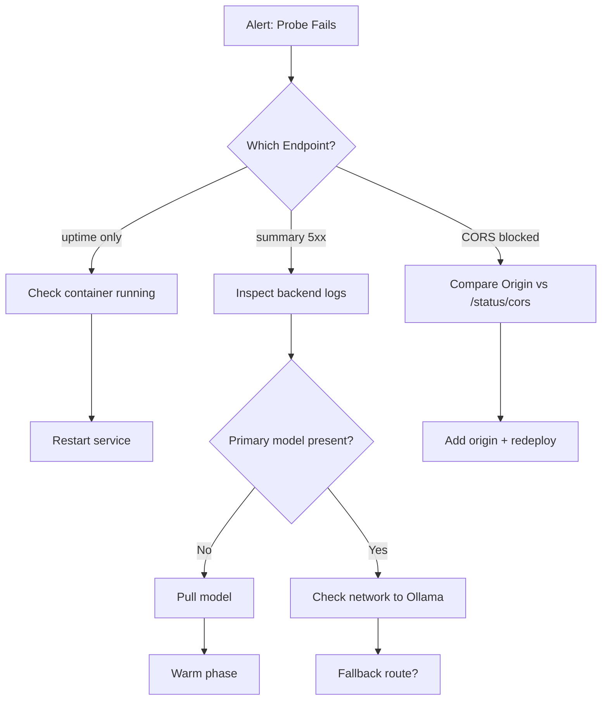

# Operations Guide

Routine operational checks and quick commands to validate health, connectivity, models, and cross-origin behavior.

## Quick Status Matrix
| Check | Endpoint / Command | Expected | Action if Failing |
|-------|--------------------|----------|-------------------|
| Uptime | `/status/uptime` | JSON with `uptime_seconds` increasing | Restart container if negative or stuck at 0 after >60s |
| Summary | `/status/summary` | `ready=true` (once warmed) | Inspect build + model presence fields |
| CORS Config | `/status/cors` | `is_allowed=true` for your origin | Add origin to `ALLOWED_ORIGINS` or set `DOMAIN` env |
| Tunnel Health | Cloudflared logs | Repeating `Registered tunnel connection` lines | Recreate tunnel / rotate token |
| Model Presence | `/status/summary` → `primary.model_present=true` | Pull model via `ollama pull <tag>` |
| SSE Connections | `/status/summary` → `sse.connections` small (<10) | Investigate runaway clients |
| Metrics | `/metrics` | JSON counters incrementing | Check for 5xx spikes |

## Minimal External Probe
For uptime monitoring use the tiny payload endpoint:
```bash
curl -s https://<host>/api/status/uptime | jq
```
Payload shape:
```json
{
  "uptime_seconds": 123.45,
  "start_time": 1733000000.123,
  "build": {"sha": "<git>", "time": "2025-09-30T17:44:22+00:00"}
}
```

## Tunnel Health
Container logs (compose example):
```bash
docker compose -f deploy/docker-compose.prod.yml -f docker-compose.cloudflared.yml logs -f cloudflared | grep -E "Registered tunnel connection|err|fail"
```
If logs show repeated auth errors:
1. Regenerate token in Cloudflare Zero Trust → Tunnels → (your tunnel) → Connect.
2. Update secret / env.
3. Recreate service.

## CORS Validation (Edge)
From inside nginx container:
```bash
docker compose -f deploy/docker-compose.prod.yml exec nginx sh -lc 'curl -is -H "Origin: https://leok974.github.io" http://localhost/api/status/summary | sed -n "1,20p"'
```
Key headers:
- `Access-Control-Allow-Origin: https://leok974.github.io`
- `Vary: Origin`
- `Cache-Control: no-store, no-cache, must-revalidate, max-age=0`

## Model Presence & Warm Path
Pull missing model (example):
```bash
docker exec -it $(docker ps -qf name=ollama) bash -lc 'ollama pull qwen2.5:7b-instruct-q4_K_M'
```
Then re-check:
```bash
curl -s https://<host>/api/status/summary | jq '.primary.model_present'
```

If warmup is slow, consider starting with env:
```bash
DISABLE_PRIMARY=1 MODEL_WAIT_MAX_SECONDS=15
```
and enabling later.

## SSE Connection Monitoring
Evaluate current open connections:
```bash
curl -s https://<host>/api/status/summary | jq '.sse.connections'
```
If unexpectedly high:
- Ensure browser tabs are closing streams.
- Add stricter connection limits in nginx (already 1 per IP for `/chat/stream`).

## Cache & No-Store Guarantee
All status endpoints return `Cache-Control: no-store, no-cache, must-revalidate, max-age=0` so external probes always get fresh state. If a CDN injects caching, add a cache-bypass rule for `/status/` and `/api/status/`.

## Incident Triage Flow


## Change Log Tie-In
Correlate build `sha` in `/status/summary` or `/status/uptime` with `docs/CHANGELOG.md` to identify newly deployed feature sets.

## Routine Daily Checklist
1. `curl -s https://<host>/api/status/uptime` – sanity.
2. `curl -s https://<host>/api/status/summary | jq '.ready,.primary.model_present'`.
3. Tail cloudflared for recent reconnects.
4. Review metrics for 5xx spikes.
5. Spot-check CORS via `/status/cors` with external origin.

---
## Status badge

Live production health is summarized via a JSON badge published by the scheduled workflow `Prod Assistant Probe`.

- Source workflow: `.github/workflows/prod-assistant-probe.yml`
- Branch output: `status-badge` (files: `status.json`, `probe.json`)
- Public endpoint (raw): `https://raw.githubusercontent.com/leok974/leo-portfolio/status-badge/status.json`
- README badge uses Shields endpoint: `https://img.shields.io/endpoint?url=.../status.json`

### Color Rules
| Color | Meaning | Criteria |
|-------|---------|----------|
| green | Healthy | All measured latencies ≤ 5s and non-null |
| orange | Degraded | Any latency > 5s and ≤ 10s |
| red | Error | Any latency > 10s |
| lightgrey | Partial | One or more latency values null (probe failure / timeout) |

### Message Values
- `ok` (green)
- `degraded` (orange)
- `error` (red)
- `partial` (lightgrey)

### Extra Payload Fields
`extra.probe` – Full latency map and metadata captured in `probe.json`
`extra.build` – Resolved from `X-Build-ID` response header (nginx sets via deployment)

### Manual Recovery
1. Re-run workflow: Actions → Prod Assistant Probe → Run workflow.
2. If branch corruption suspected:
  ```bash
  git fetch origin --prune
  git checkout -B status-badge origin/status-badge || git checkout -b status-badge
  # (Recreate status.json / probe.json locally if needed)
  git add status.json probe.json
  git commit -m "badge: manual repair"
  git push -u origin status-badge
  ```
3. Validate badge JSON parses:
  ```bash
  curl -s https://raw.githubusercontent.com/leok974/leo-portfolio/status-badge/status.json | jq .
  ```

### Future Enhancements (TODO)
- SLO gating: fail workflow if worst latency exceeds threshold N times.
- Percentile tracking (store prior probe on branch and merge stats).
- Uptime streak & last failure timestamp.
- Distinguish network vs application nulls (different color codes).

### SLO Gating (Implemented)
The probe workflow enforces two latency thresholds:

| Variable | Default | Purpose |
|----------|---------|---------|
| `SLO_MAX_MS` | 5 | Soft SLO (warn/fail if exceeded) |
| `HARD_MAX_MS` | 10 | Hard ceiling (immediate failure) |
| `ALLOW_PARTIAL` | false | If false and any latency is null, job fails |

Failure modes:
- Partial data (null latency) when `ALLOW_PARTIAL=false`.
- Any latency > `HARD_MAX_MS`.
- Any latency > `SLO_MAX_MS` (soft threshold) — still fails to surface degradation.

Adjust by editing the final "Enforce SLO thresholds" step in `.github/workflows/prod-assistant-probe.yml`.

### Establishing Baselines
Collect several probe cycles (≥ 24h) then derive medians/p95:
```bash
git fetch origin status-badge:status-badge
git checkout status-badge
grep -h '"latencies"' status.json 2>/dev/null || true
```
For a richer approach, script extraction:
```bash
git log --format='%H' -- status.json | head -n 40 | while read sha; do
  git show ${sha}:status.json | jq -r '[.extra.probe.latencies.root,.extra.probe.latencies.ready,.extra.probe.latencies.status,.extra.probe.latencies.chat] | @csv'
done > latency-samples.csv
```
Then process in Python or a spreadsheet for median / p95 to refine `SLO_MAX_MS`.

---
*This guide is a living document — update as new operational behaviors emerge.*

## Operational Helper Scripts (Local Diagnostics)

The following scripts streamline recurring health + streaming checks:

| Script | Purpose | Invocation |
|--------|---------|------------|
| `scripts/all-green.ps1` | One-shot readiness, summary, latency, chat (non-stream + SSE) | `pwsh ./scripts/all-green.ps1 -Base http://localhost:8080` |
| `scripts/chat-probe.mjs` | Minimal Node SSE probe (truncates after ~2KB) | `node ./scripts/chat-probe.mjs` |
| `scripts/chat-stream.ps1` | Native PowerShell raw SSE stream capture (no curl/node) | `pwsh ./scripts/chat-stream.ps1 -Base http://localhost:8080` |

### When to Use Which
* Quick daily spot check → `all-green.ps1`
* CI / automated streaming validation → `chat-probe.mjs`
* Windows-only environment w/out curl/node streaming → `chat-stream.ps1`

### Non-Stream vs SSE
If `/chat` exists it returns the entire answer JSON at once (blocked until completion). `/chat/stream` emits incremental SSE `data:` lines and should be favored for latency-sensitive UX. The scripts degrade gracefully if the non-stream endpoint is absent.

### curl.exe vs PowerShell Alias
PowerShell sometimes aliases `curl` to `Invoke-WebRequest`. Use the real binary (Git for Windows provides one) for SSE: `Remove-Item alias:curl -ErrorAction SilentlyContinue` then invoke `curl -N ...`.

### Sample Output (Truncated)
```
▶ ready:
{"status":"ok"}
▶ summary (key bits): {"ready":true,"primary_model_present":true,"build_sha":"<sha>"}
▶ latency: {"stats":{"p95_ms":12.1}}
▶ chat/stream: data: {"role":"assistant","delta":"Hello ... _served_by:primary"}
```

## Warming JSON & Health-Gated Startup (Edge Behavior)

Cold starts or mid-life model reloads previously surfaced as transient 502/503 from the backend while the primary model initialized. To provide a stable UX we now employ a two-layer strategy:

1. Compose health gating: `nginx` waits until `backend` reports healthy (via `/api/ready`) before it starts, eliminating cold-start 5xx exposure.
2. Warming JSON intercept: After both are running, if the backend temporarily returns a 5xx during (re)warm, nginx intercepts `/api/status/summary` errors and returns a canonical warming payload with HTTP 200.

### Warming Payload
Path: `/api/status/summary`

Example response while warming:
```json
{"ok":false,"ready":false,"llm":{"path":"warming"},"rag":{"ok":true}}
```
Headers include: `Cache-Control: no-store, no-cache, must-revalidate, max-age=0` ensuring clients never cache transitional readiness states.

### Frontend Handling
- Show a pill or banner: `Warming model…`
- Poll every 5–10 seconds until `ready=true`.
- Treat `llm.path == "warming"` as non-error transitional state (avoid red error UI).

### Health Gating Details
- Backend healthcheck (compose) polls: `http://localhost:8000/api/ready` using Python stdlib (no curl dependency) every 5s, up to 5 minutes.
- Nginx `depends_on.backend.condition=service_healthy` ensures the edge layer does not accept traffic prematurely.

### Quick Verification
Cold bring-up (nginx should delay until backend healthy):
```bash
docker compose -f deploy/docker-compose.prod.yml down
docker compose -f deploy/docker-compose.prod.yml up -d backend nginx
docker compose -f deploy/docker-compose.prod.yml ps
```
Expect `nginx` in `created` or `starting` state until backend healthcheck passes, then transitions to `running`.

Warming intercept (simulate by restarting backend only):
```bash
docker compose -f deploy/docker-compose.prod.yml restart backend
curl -i http://127.0.0.1:8080/api/status/summary
```
Expect `HTTP/1.1 200 OK` with warming JSON for a brief window instead of 502.

Outside (through tunnel):
```bash
curl -s https://<host>/api/status/summary | jq
```
Should mirror local behavior and maintain `no-store` caching headers.

### Operational Rationale
- Eliminates noisy cold-start alarms in external uptime monitors.
- Provides deterministic JSON contract for UI and dashboards.
- Avoids client-side exponential backoff logic for transient 5xx bursts.

### Degradation Modes
| Scenario | Behavior | Next Action |
|----------|----------|-------------|
| Backend fails healthcheck repeatedly | Nginx never starts | Inspect backend logs & model pull |
| Backend restarts mid-traffic | Warming JSON for status path only | Monitor restart cause; user chat may queue |
| Model permanently missing | `ready=false` persists; no warming path | Pull model / fix config |
| Tunnel down | Local status OK; remote curl fails | Recreate cloudflared / check token |

---
