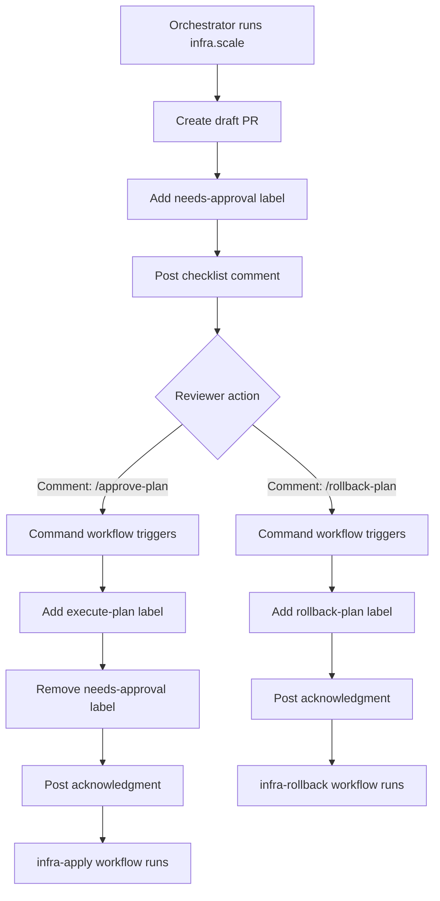

# PR Checklist and Chat Commands - Implementation Complete

**Date**: October 11, 2025
**Status**: ✅ Complete

## Overview

Successfully implemented an interactive PR checklist system with chat commands for easy plan approval and rollback workflows. The system eliminates manual label management and provides one-click approval via comments.

## Components Created

### 1. PR Checklist Function

**File**: `scripts/infra.scale.mjs`

**Function**: `postPRChecklist(octo, issueNumber)`

**Features**:
- Posts interactive checklist comment when plan PR is created
- Includes review items (plan.yaml, SUMMARY.md, namespace, workloads, capacity)
- Provides quick action commands (`/approve-plan`, `/rollback-plan`)
- Non-fatal (try/catch) - won't break PR creation if comment fails

**Integration**:
- Called automatically in `openPR()` function after creating new PR
- Only posts for new PRs (not when updating existing PRs)

**Checklist Content**:
```markdown
## ✅ Infra Scale Plan – Review Checklist

- [ ] Review `plan.yaml` and `SUMMARY.md`
- [ ] Confirm namespace and workloads
- [ ] Capacity & budget LGTM

### Quick actions
- To **apply** this plan, comment: **/approve-plan** (adds label `execute-plan`)
- To **prepare rollback**, comment: **/rollback-plan** (adds label `rollback-plan`)

> Both actions are label-gated by CI. Remove labels to stop jobs. 🚦
```

### 2. Command Listener Workflow

**File**: `.github/workflows/plan-commands.yml`

**Trigger**: `issue_comment` (type: `created`)

**Permissions**:
- `issues: write` - Add/remove labels, post comments
- `pull-requests: read` - Read PR context

**Flow**:
1. **Parse command** - Extract command from comment, convert to lowercase
2. **Route command** - Map to appropriate label:
   - `/approve-plan` → `execute-plan`
   - `/rollback-plan` → `rollback-plan`
3. **Add label** - Use `actions-ecosystem/action-add-labels@v1`
4. **Remove needs-approval** - When `/approve-plan` is used (via `actions-ecosystem/action-remove-labels@v1`)
5. **Acknowledge** - Post confirmation comment (via `peter-evans/create-or-update-comment@v4`)

**Command Parsing**:
```bash
body="${{ github.event.comment.body }}"
cmd=$(echo "$body" | tr '[:upper:]' '[:lower:]' | tr -d '\r' | sed 's/^[[:space:]]*//;s/[[:space:]]*$//')
if echo "$cmd" | grep -q "^/approve-plan"; then
  echo "label=execute-plan" >> $GITHUB_OUTPUT
elif echo "$cmd" | grep -q "^/rollback-plan"; then
  echo "label=rollback-plan" >> $GITHUB_OUTPUT
else
  echo "label=" >> $GITHUB_OUTPUT
fi
```

## Chat Commands

### /approve-plan

**Purpose**: Approve and execute the infrastructure scaling plan

**Actions**:
1. Adds `execute-plan` label to PR
2. Removes `needs-approval` label from PR
3. Posts acknowledgment: "Command **execute-plan** queued. ✅"
4. Triggers `.github/workflows/infra-apply.yml` workflow

**Usage**:
```markdown
/approve-plan
```

**Who Can Use**: Anyone with write access to the repository (GitHub enforces this at the workflow level)

### /rollback-plan

**Purpose**: Prepare rollback for the infrastructure changes

**Actions**:
1. Adds `rollback-plan` label to PR
2. Posts acknowledgment: "Command **rollback-plan** queued. ✅"
3. Triggers `.github/workflows/infra-rollback.yml` workflow (dry-run with PR comment)

**Usage**:
```markdown
/rollback-plan
```

**Who Can Use**: Anyone with write access to the repository

## Workflow Integration

### Label-Triggered Workflows

| Label | Workflow | Action |
|-------|----------|--------|
| `needs-approval` | None | Initial review gate |
| `execute-plan` | `infra-apply.yml` | Execute kubectl commands |
| `rollback-plan` | `infra-rollback.yml` | Run rollback (dry-run + optional execution) |

### Complete Flow



## Benefits

### 1. One-Click Approval
- No manual label management
- Simple comment commands
- Immediate feedback via acknowledgment comments

### 2. Clear Review Process
- Interactive checklist guides reviewers
- All review items in one place
- Quick actions prominently displayed

### 3. First-Party Solution
- No external bots required
- Uses native GitHub Actions
- Standard permissions model

### 4. Safety Gates Preserved
- Label-based workflow triggering unchanged
- Remove label to stop workflow
- Clear audit trail via comments

### 5. Flexible Usage
- Chat commands for convenience
- Manual label management still works
- GitHub CLI compatible

## Usage Examples

### Example 1: Approve Plan via Comment

**Scenario**: Reviewer approves infrastructure scaling plan

```markdown
# PR comment
/approve-plan
```

**Result**:
1. Label `execute-plan` added
2. Label `needs-approval` removed
3. Acknowledgment comment posted
4. Apply workflow triggered
5. kubectl commands executed

### Example 2: Prepare Rollback

**Scenario**: Team wants rollback preview before applying

```markdown
# PR comment
/rollback-plan
```

**Result**:
1. Label `rollback-plan` added
2. Acknowledgment comment posted
3. Rollback workflow triggered (dry-run)
4. Rollback summary posted as PR comment

### Example 3: Manual Label Management

**Scenario**: Using GitHub CLI instead of comments

```bash
# Add execute-plan label
gh pr edit <PR-NUMBER> --add-label execute-plan

# Remove needs-approval label
gh pr edit <PR-NUMBER> --remove-label needs-approval
```

**Result**: Same as chat command (workflows trigger on label addition)

### Example 4: Stop Workflow

**Scenario**: Need to stop apply workflow before it runs

```bash
# Remove execute-plan label
gh pr edit <PR-NUMBER> --remove-label execute-plan
```

**Result**: Workflow won't trigger (label gate blocks execution)

## Security & Permissions

### Workflow Permissions

**plan-commands.yml**:
```yaml
permissions:
  issues: write        # Add/remove labels, post comments
  pull-requests: read  # Read PR context
```

**infra-apply.yml**:
```yaml
permissions:
  contents: read       # Read code
  pull-requests: read  # Read PR details
```

**infra-rollback.yml**:
```yaml
permissions:
  contents: read           # Read code
  pull-requests: write     # Post rollback summary comments
```

### Access Control

- GitHub enforces repository write access for `issue_comment` events
- Only users with write access can trigger commands
- Workflow permissions are minimal (principle of least privilege)
- Label-based gates provide additional safety layer

## Testing

### Test Checklist

- [ ] Create plan PR, verify checklist comment posted
- [ ] Comment `/approve-plan`, verify:
  - `execute-plan` label added
  - `needs-approval` label removed
  - Acknowledgment comment posted
  - Apply workflow triggered
- [ ] Comment `/rollback-plan`, verify:
  - `rollback-plan` label added
  - Acknowledgment comment posted
  - Rollback workflow triggered
- [ ] Test case variations:
  - `/APPROVE-PLAN` (uppercase)
  - `  /approve-plan  ` (extra whitespace)
  - `/approve-plan followed by more text`
- [ ] Manual label management still works
- [ ] Remove label stops workflow

### Test Commands

```bash
# 1. Trigger orchestrator (creates PR with checklist)
ENABLE_INFRA_SCALE=1 GH_OWNER=<owner> GH_REPO=<repo> GITHUB_TOKEN=<token> \
node scripts/orchestrator.nightly.mjs

# 2. Verify checklist comment exists on PR
gh pr view <PR-NUMBER>

# 3. Post approve command
gh pr comment <PR-NUMBER> --body "/approve-plan"

# 4. Check labels
gh pr view <PR-NUMBER> --json labels

# 5. Verify workflow triggered
gh run list --workflow=infra-apply.yml

# 6. Test rollback command
gh pr comment <PR-NUMBER> --body "/rollback-plan"

# 7. Verify rollback workflow
gh run list --workflow=infra-rollback.yml
```

## Command Parsing Details

### Supported Command Formats

All of these work (case-insensitive, whitespace-tolerant):

```markdown
/approve-plan
/APPROVE-PLAN
  /approve-plan
/approve-plan
/approve-plan followed by explanation
```

### Command Detection

```bash
# Normalize: lowercase, trim, remove \r
cmd=$(echo "$body" | tr '[:upper:]' '[:lower:]' | tr -d '\r' | sed 's/^[[:space:]]*//;s/[[:space:]]*$//')

# Match: starts with command
if echo "$cmd" | grep -q "^/approve-plan"; then
  # Match!
fi
```

### Why This Works

- `tr '[:upper:]' '[:lower:]'` - Convert to lowercase
- `tr -d '\r'` - Remove Windows line endings
- `sed 's/^[[:space:]]*//;s/[[:space:]]*$//'` - Trim whitespace
- `grep -q "^/approve-plan"` - Match start of string

## Acknowledgment Comments

### Format

```markdown
Command **<label>** queued. ✅
```

### Examples

After `/approve-plan`:
```markdown
Command **execute-plan** queued. ✅
```

After `/rollback-plan`:
```markdown
Command **rollback-plan** queued. ✅
```

### Purpose

- Immediate feedback to user
- Confirms command was parsed correctly
- Shows which label was added

## GitHub Actions Used

### actions-ecosystem/action-add-labels@v1

**Purpose**: Add labels to issues/PRs

**Usage**:
```yaml
- uses: actions-ecosystem/action-add-labels@v1
  with:
    github_token: ${{ secrets.GITHUB_TOKEN }}
    labels: execute-plan
```

### actions-ecosystem/action-remove-labels@v1

**Purpose**: Remove labels from issues/PRs

**Usage**:
```yaml
- uses: actions-ecosystem/action-remove-labels@v1
  with:
    github_token: ${{ secrets.GITHUB_TOKEN }}
    labels: needs-approval
```

### peter-evans/create-or-update-comment@v4

**Purpose**: Post or update comments on issues/PRs

**Usage**:
```yaml
- uses: peter-evans/create-or-update-comment@v4
  with:
    issue-number: ${{ github.event.issue.number }}
    body: |
      Command **execute-plan** queued. ✅
```

## Files Modified/Created

| File | Status | Changes |
|------|--------|---------|
| `scripts/infra.scale.mjs` | ✅ Modified | Added `postPRChecklist()` function, integrated into `openPR()` |
| `.github/workflows/plan-commands.yml` | ✅ Created | Command listener workflow with parsing and label management |
| `INFRA_ORCHESTRATOR_QUICKREF.md` | ✅ Updated | Added chat commands section, updated approval gates |

## Troubleshooting

### Checklist Comment Not Posted

**Symptoms**: PR created but no checklist comment

**Causes**:
1. GitHub token missing `issues:write` permission
2. Octokit request failed (non-fatal, caught by try/catch)
3. PR is update (not new), checklist only posts for new PRs

**Solution**:
```bash
# Check token has correct permissions
gh auth status

# Manually post checklist (if needed)
gh pr comment <PR-NUMBER> --body "$(cat <<'EOF'
## ✅ Infra Scale Plan – Review Checklist
...
EOF
)"
```

### Command Not Triggering Workflow

**Symptoms**: Comment posted but no label added, no workflow triggered

**Causes**:
1. Command format incorrect (typo, extra characters before `/`)
2. Workflow file has syntax error
3. Insufficient permissions (user doesn't have write access)
4. Workflow disabled in repository settings

**Solution**:
```bash
# Test workflow syntax
gh workflow view plan-commands.yml

# Check workflow runs
gh run list --workflow=plan-commands.yml

# Verify user has write access
gh api repos/<owner>/<repo>/collaborators/<username>/permission
```

### Acknowledgment Comment Not Posted

**Symptoms**: Label added but no acknowledgment comment

**Causes**:
1. `peter-evans/create-or-update-comment@v4` action failed
2. GitHub API rate limit exceeded
3. Insufficient permissions

**Solution**:
```bash
# Check workflow logs
gh run view <run-id> --log

# Check rate limit
gh api rate_limit
```

## Next Steps

### Future Enhancements

1. **More Commands**:
   - `/cancel-plan` - Close PR without executing
   - `/update-plan` - Trigger plan regeneration
   - `/validate-plan` - Run validation checks

2. **Richer Feedback**:
   - Link to workflow run in acknowledgment
   - ETA for workflow completion
   - Success/failure updates

3. **Multi-Approver**:
   - Require N approvals before execution
   - Track who approved via reactions

4. **Conditional Execution**:
   - Execute only if checks pass
   - Require specific approver role

## Quick Reference

### Create Plan PR
```bash
ENABLE_INFRA_SCALE=1 GH_OWNER=<owner> GH_REPO=<repo> GITHUB_TOKEN=<token> \
node scripts/orchestrator.nightly.mjs
```

### Approve Plan
```markdown
/approve-plan
```

### Prepare Rollback
```markdown
/rollback-plan
```

### Stop Workflow
```bash
gh pr edit <PR-NUMBER> --remove-label execute-plan
```

### Check Status
```bash
gh pr view <PR-NUMBER> --json labels
gh run list --workflow=infra-apply.yml
```

---

**Implementation Complete** - PR checklist and chat commands ready for production use! 🎉
